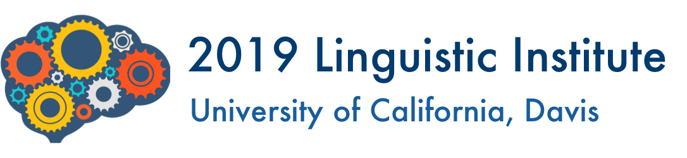

 
 
 
 

# Introduction to video for documentary linguistics

In this class, we'll learn the basics of video recording (static, multi-party) speech events for the purposes of documentation. The class will be split into two parts: 

  1. Video recording ([slides](https://mcdonn.github.io/2019-lsa-institute-video/2019-video-recording-pres/2019-video-recording-pres.html#1))
  1. Processing/video editing ([slides](https://mcdonn.github.io/2019-lsa-institute-video/2019-video-editing-pres/2019-video-editing-pres.html#1))

Unfortunately, due to time constraints, we *won't* have time to make video recordings. However, toward the end of the class, we will practice video editing for the purposes of archiving and creating media for transcription in ELAN. In order to do this, students need to download [Adobe Premiere](https://www.adobe.com/products/premiere.html). **Note that Adobe Premiere is proprietary**, so we will be downloading a free trial. **It is imperative that you cancel your membership before your trial is up to avoid being charged!** 

## Instructions for downloading Adobe Premiere (Please complete before class)

1. Go to (https://www.adobe.com/products/premiere.html)
1. Click "Free Trial" in upper righthand corner. 
1. Click on "Students & Teachers" 
1. Click on blue button "Start free trial"
1. Then you'll be asked for your email and other info.

## Download exercise files from UH File Drop (Please complete before class)

1. Everyone will receive an email with a link to download video files. 
1. If you do not recive this email, please contact me at <mcdonn@hawaii.edu>.