# Syncing Audio & Video with Adobe Premiere (2019)

## Step 1: Creating a New Project

- Open Adobe Premiere
- Select `New Project...` on splash screen

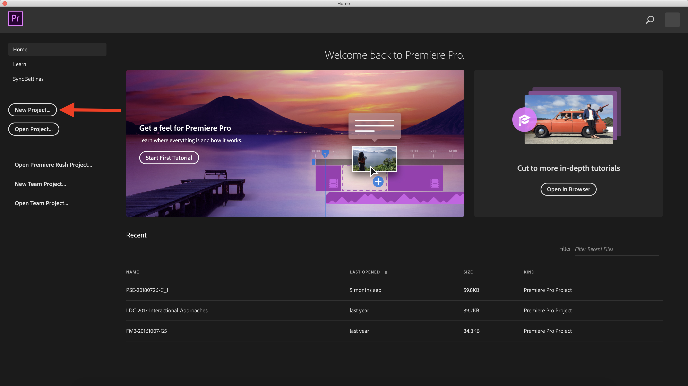

- Change the `Name` to "SAS-20161007-E" and the `Location:` to an appropriate directory. 

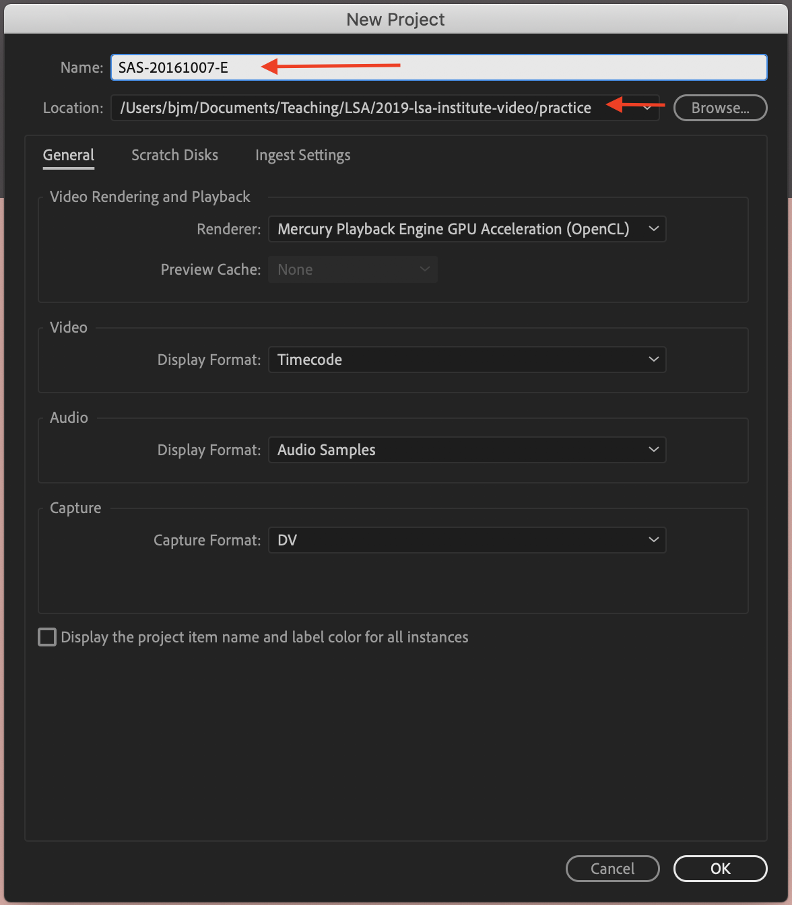

## Step 2: Importing Media

- Click anywhere in the "Project Pane" in the lower left corner that says `Import media to start`
- Navigate to the "practice" folder you downloaded 
- Select the "AVCHD" video in the "PRIVATE" folder and click `Import`
  - You may receive an error. It's okay to ignore this error and click `OK`
- Repeat the steps above for the audio file "SAS-20161007-O"

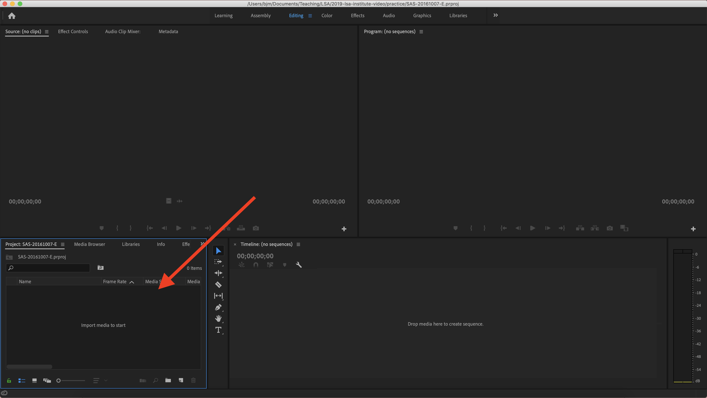

- Your window should now look like this. 

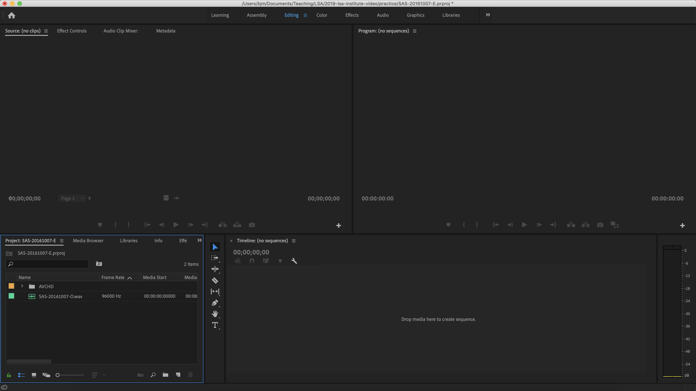

## Step 3: Creating a sequence

- In the Project Pane, expand the "AVCHD" folder and drag the "00000.MTS" file over to the right to the timeline pane in the lower right corner. 
  - **Note:** It's important that you do **not** rename or alter the .MTS file in any way. AVCHD files are complex and when a video recording is long (e.g., an hour or so), your AVCHD file will create multiple MTS files. What's nice is that Premiere keeps track of the fact that the multiple MTS files belong to a single recording. However, when the file is is changed this information is lost. 

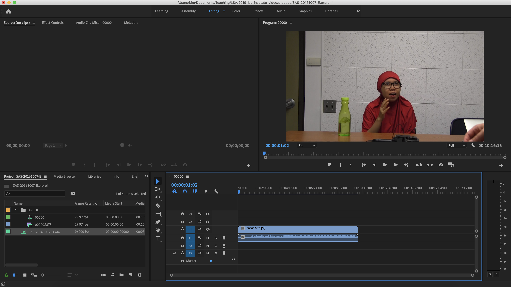

- Next drag the audio file into the track labeled A2 on the timeline.

  - Note that the separate audio and video tracks do not align when played. Try playing the files in the timeline pane, and you will hear two separate audio tracks.

- Notice that Premiere created a sequence file automatically named "000000" inside the AVCHD folder. For organization sake, it's a good idea rename the sequence "SAS-20161007-E" and drag it out of the AVCHD folder. 

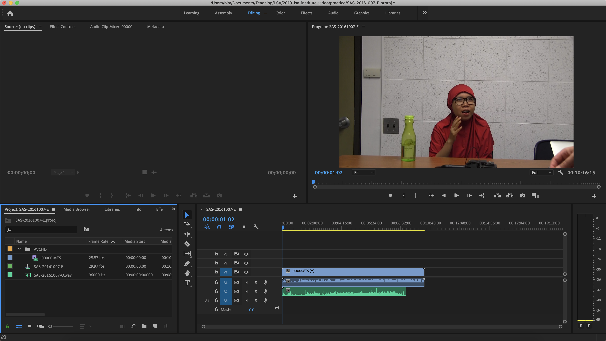

## Step 4: Synchronizing Audio and Video

- Select both the audio and video tracks in the Timeline Pane, so that their borders turn white.
- Right click anywhere on the audio and video tracks in the timeline pane, and select `Synchronize`

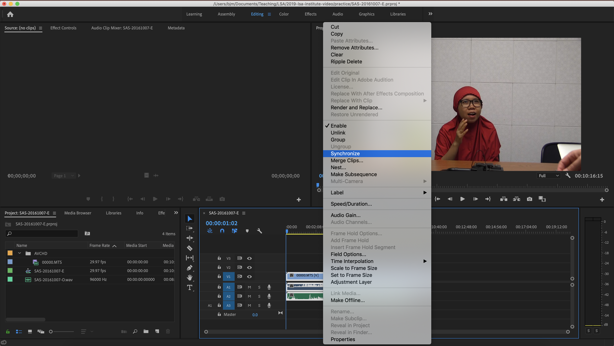

- A pop-up menu appears with `audio` selected. Keep this as is and click "OK".

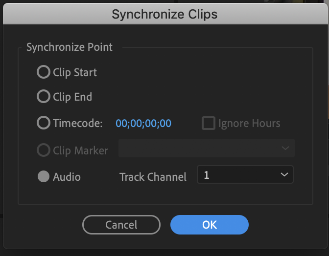

- The video and audio tracks are now synced, but are still different lengths. 

  - All else being equal, it is best for the audio and video to be of the same length to avoid any issues with transcriptions being out of sync. If they're the same length, then there's no concern for the two being out of sync. At the very least, the audio file and video file should have the same starting point. 

- To acheive this end, use the razor tool to cut the video to the same length as the audio. 

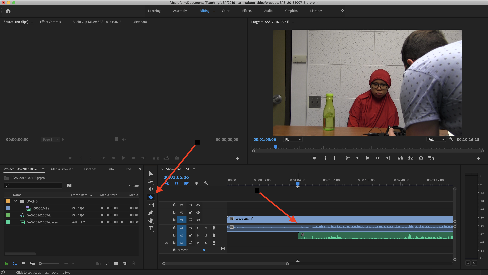

- Cut the audio and/or video at the same point on the timeline, then delete the 'left over' segment of video that is left of the cut.

- Next, move both audio and video tracks to the beginning of the sequence by either selecting both tracks and draging them to the beginning of the sequence. Or, simply select the empty (black) portion of the video track and press the "delete" key.

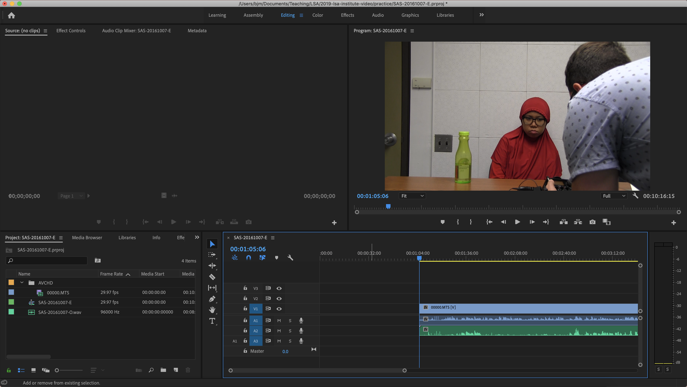

- Follow the same steps above to cut the end of the recording, ensuring that the audio and video tracks are the same length. Zoom in, if necessary, using the scroll bar at the bottom.

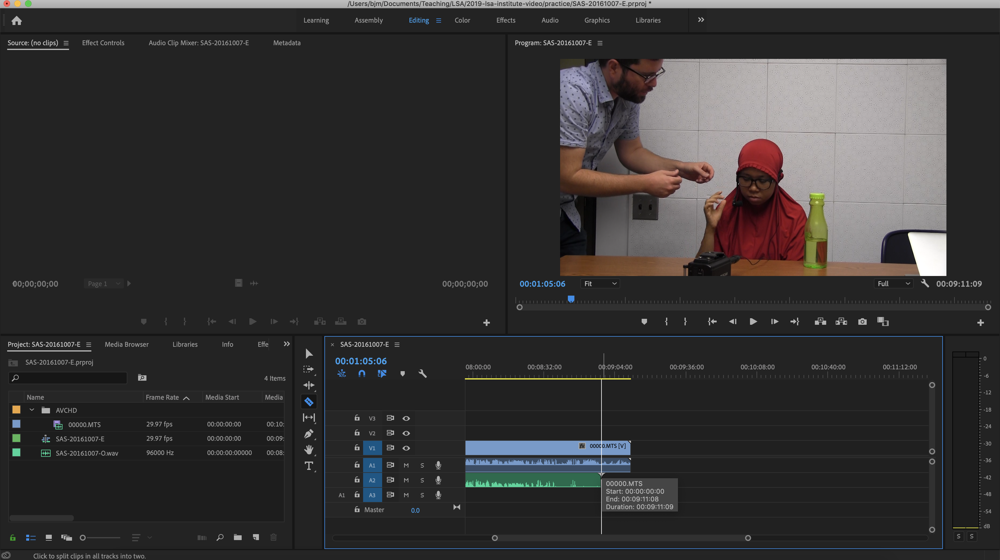

- The sequence should now look the image below.

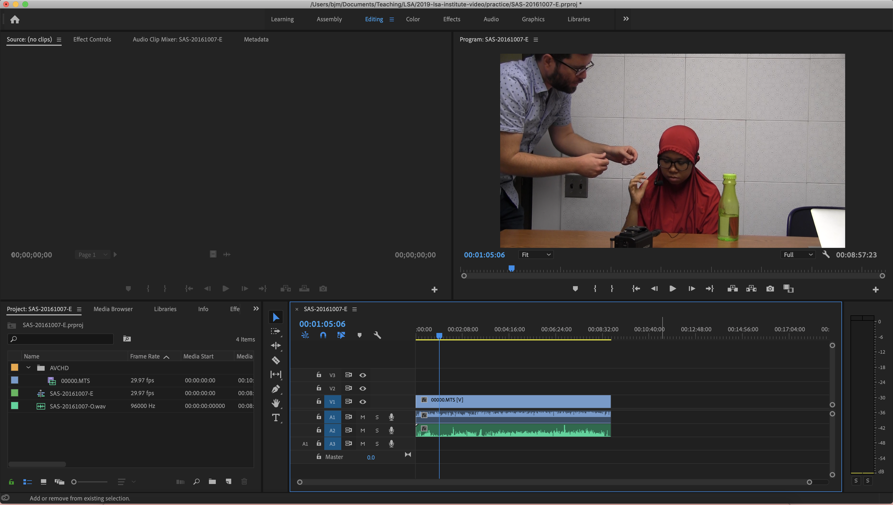

## Step 4: Export edited video

- The sequence is now ready for export. 
- Start by exporting the video.

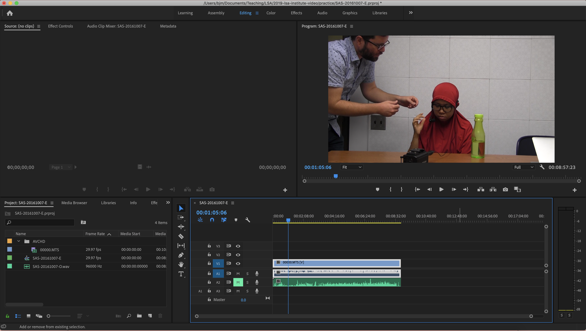

- To do this, mute the audio (.wav) track by selecting the `M` immediately left of the track.
- Select the video segment on the timeline, so that its borders turn white.
- Click `File` > `Export` > `Media...`

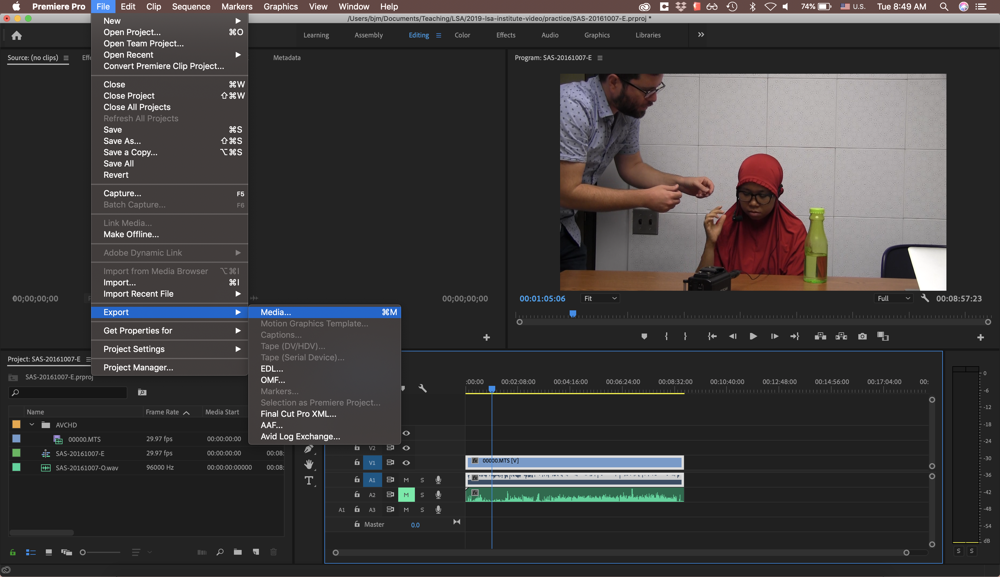

- A pop-up menu `Export Settings` will appear.
- Under the format drop down menu, select `H.264`.
  - The preset should be `Match Source - High bitrate` if say you wanted to archive the file, but it's possible or even preferable to export a lower quality file for transcription in ELAN.
- Click on the `Output Name` and select a location (e.g., in the directory SAS-20161007-E) and name the file (e.g., SAS-20161007-E.mp4).
- Click `Queue` at the bottom of the pop-up menu.

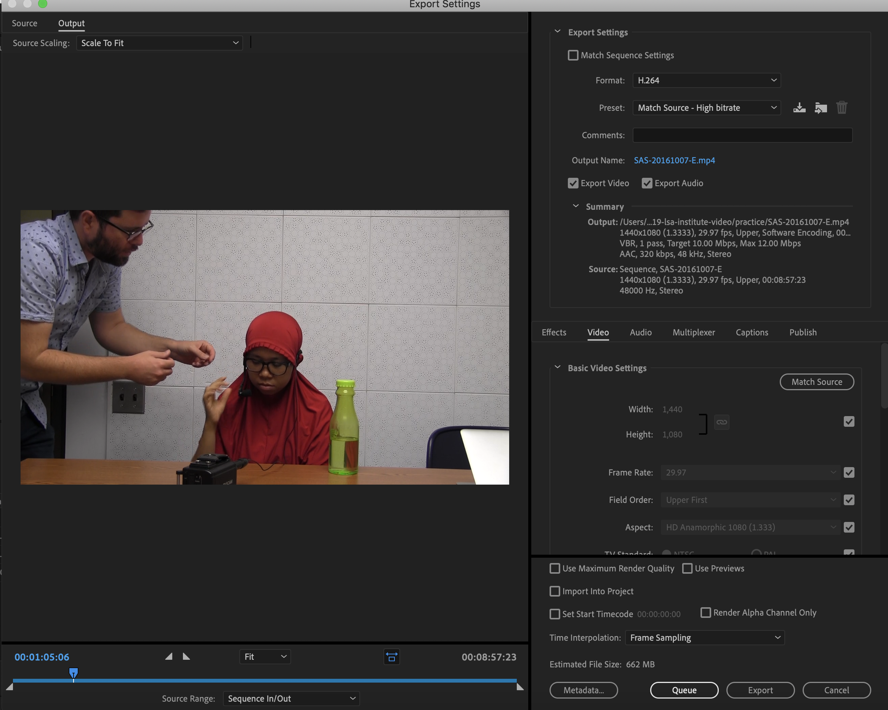

- Queue prompts another program **Media Encoder** to open.
  - Media Encoder allows media to be exported in a convenient manner.
    - For example, it's possible to continue working in Premiere, pause an exporting video, or even save an project to be exported later.

- Once the job shows up in the queue, click the green play button in the upper right corner to begin the export process.    

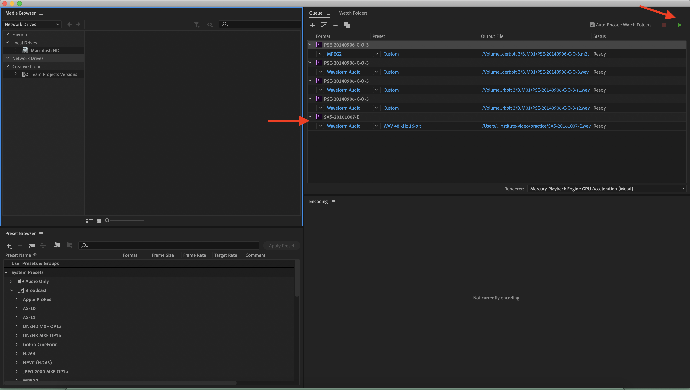

- Now, go back to Premiere and export the audio track. 
- Mute the video (.mts) track by selecting both the eye icon so that it has a slash through it and the M icon immediately left of the track.
- Select the audio (A2, .wav) segment on the timeline.
- Click `File` > `Export` > `Media...`.
- The pop-up menu `Export Settings` will appear.

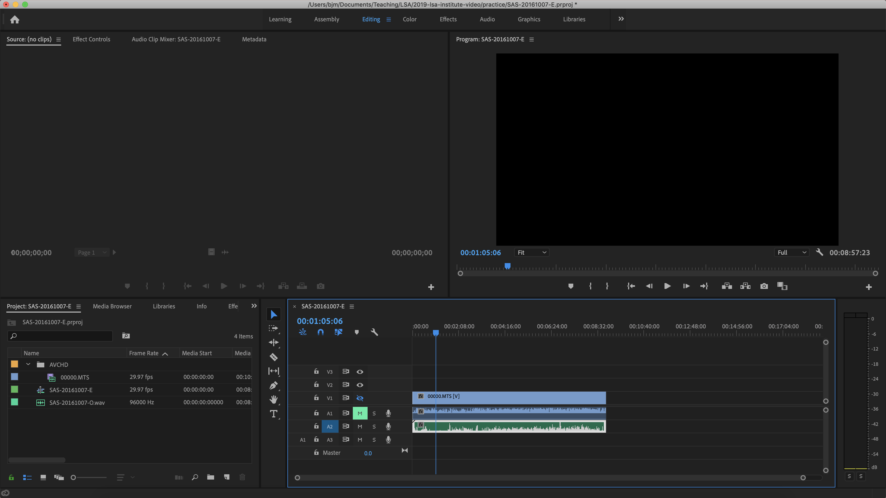

- Under the format drop down menu, select `Waveform Audio`.
  - The preset should be `WAV 48 kHz 16-bit`.
  - Click on the `Output Name` and select a location (e.g., in the directory SAS-20161007-E) and name the file (e.g., SAS-20161007-E.wav).
- Click `Queue` at the bottom of the pop-up menu, and your export job will appear in Media Ecoder

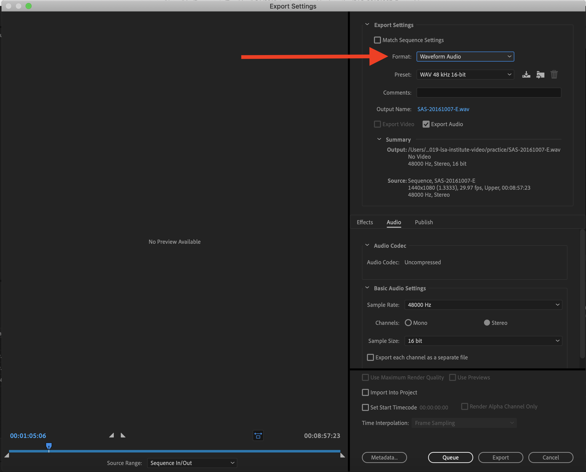
